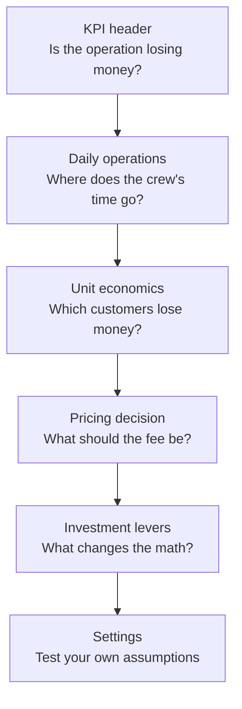
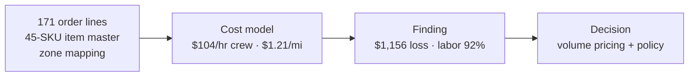
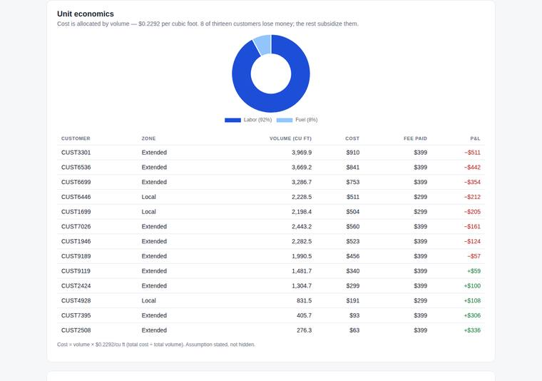

# Delivery Economics Dashboard

**A white-glove delivery operation losing $1,156 on 13 orders — and the fix isn't routing, it's pricing.**

A national luxury furniture retailer offered white-glove delivery at a flat rate per order. This dashboard is the business-facing view of the rebuild: the operation modeled end to end, the loss proven structural, and the decisions laid out. Labor is 92% of the cost, the service standard is fixed, and a 20% routing improvement saves $96 against a $1,156 loss. The only levers big enough are price and policy.

Companion case study: [*Pricing, Not Routing*](../rh-delivery-economics-case-study.md) — the full SPIDER write-up (Summary, Problem, Inputs, Discovery, Execution, Results).

## Flow

Each view answers one question, in order:

The analytical flow underneath:

## The views

1. **KPI header** — total cost $6,043, revenue $4,887, net −$1,156, margin −23.7%, $465 per delivery, 92% labor share. The white-glove service standard sits above it all as a fixed constraint: no split orders, full install + staging + cleanup.
2. **Daily operations** — the 7-day schedule (loads, travel/service minutes, miles) plus the concierge rescheduling policy: first reschedule free, $75 after — framed as service, priced to cover the wasted trip.
3. **Unit economics** — labor/fuel split and a per-customer P&L table. Cost is allocated by volume ($0.2292/cu ft, stated in-app). Eight of thirteen customers lose money; the five smallest orders subsidize the rest.

4. **Pricing decision** — interactive calculator: any order volume against the proposed $150 + $0.25/cu ft formula. Breakeven on the current book needs +$88.94 per delivery; the volume formula gets there without punishing small orders (276 cu ft → $219, 3,970 cu ft → $1,143).
5. **Investment levers** — two trucks (+$1,092, rejected), luxury pace (+$3,040 — the price tag of the brand promise at its extreme), bigger truck (−$1,664, the only lever that reaches profitability: $508 profit).
6. **Settings** — editable crew rate, $/mile, fees, hours, miles. Every figure on the page recomputes live, including the scenario cards.

## Run it

Open `index.html` in any browser — no build step, no server. Charts load from a CDN, so it needs internet on first load. If charts can't load, the KPIs and tables still render.

## Notes

- Crew rate is the case-documented $104/hr (driver premium + 30% benefits). The submitted coursework used $97.50 with the premium omitted; the restatement is documented in the case study, and the thesis held.
- Distances estimated at 25 mph, no traffic modeling. Schedule minutes are as-planned; the P&L uses verified totals (53.5 hrs, 396 mi).
- Anonymized: no company, instructor, or customer names. Customer IDs are anonymous.
