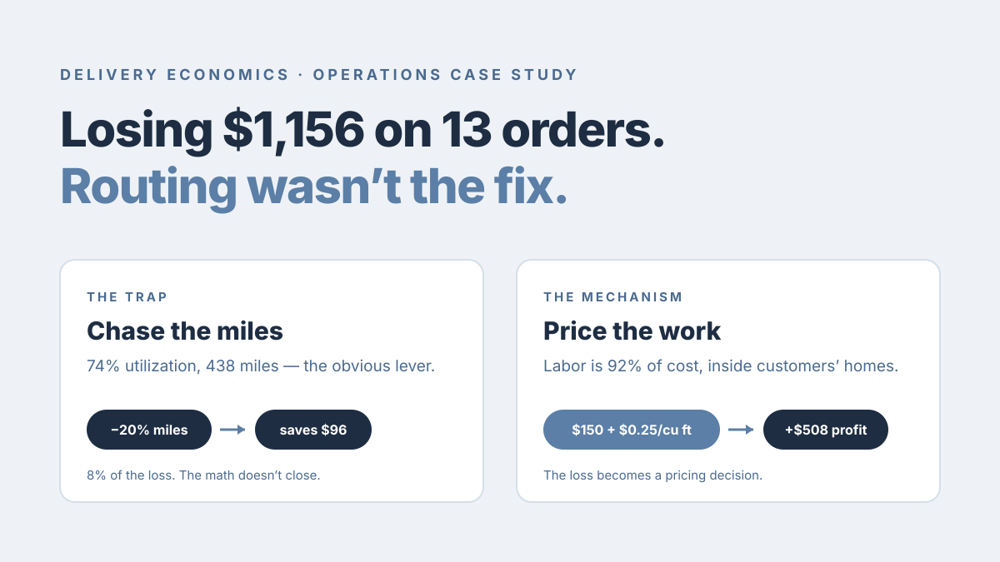
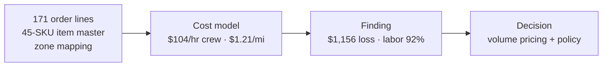
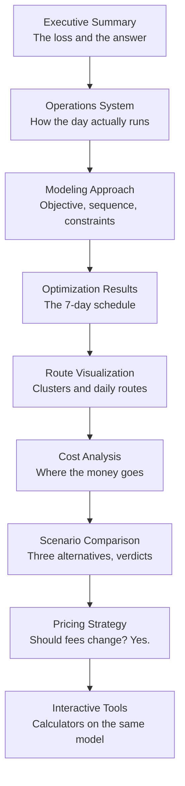

# Delivery Economics

A white-glove delivery operation losing **$1,156 on 13 orders** — and the fix isn't routing, it's pricing. I rebuilt the whole case from 171 raw order lines: the cost model, the 7-day operating schedule, and the operating system that runs the day. The presentation, the dashboard, the operations design, and every number below are reproducible from the raw data.

**Live:** [Presentation](https://lorisca-analytics.github.io/delivery-economics-dashboard/) · [Dashboard](https://lorisca-analytics.github.io/delivery-economics-dashboard/dashboard.html) · [Operations design](https://lorisca-analytics.github.io/delivery-economics-dashboard/operations.html)

## What's inside

| Path | What it is |
|---|---|
| `index.html` | Presentation page — the case, the finding, the links |
| `dashboard.html` | The 9-section analytical dashboard (open in any browser, no build step) |
| `operations.html` | Proposed operational design flow — dispatch, driver app, decision rules |
| `CASE-STUDY.md` | Full case study write-up |
| `data/` | Raw inputs: 171 order lines, 45-SKU item master, customer addresses |
| `analysis/recompute.py` | Reproduces every dashboard number from `data/` — run it |
| `docs/` | Diagrams: cover, SPIDER framework, analysis path |
| `screenshots/` | Dashboard visuals |

## The case, SPIDER-style

**S — Summary.** I was asked to optimize the operation: routes, truck loading, and the daily schedule for 13 Bay Area customers. I built the cost model from 171 raw order lines, optimized down to 7 days and 21 truckloads, and proved the loss is structural — then rebuilt the whole thing for publication with case-accurate numbers.

**P — Problem.** The flat-rate promise is a brand differentiator and a money loser: one customer pays $399 for 276 cubic feet, another pays $399 for 3,970. The white-glove standard is fixed — no split orders, no rushed crews, full install and staging — so cost-only optimization was never on the table. This is a workforce economics problem: a $104/hr three-person crew, 15-minute time rounding, 7 days of scheduled labor.

**I — Inputs.** Four sources, all in [`data/`](data/): 171 order lines, a 45-SKU item master (volume/weight per piece), customer addresses for zone mapping, and the case-documented operating parameters. [`analysis/recompute.py`](analysis/recompute.py) reproduces every number on this page from those files — run it.

**D — Discovery.** All 171 lines mapped with zero misses. Volume binds before weight. Three customers drive 41% of the volume. And the audit caught three contradictions in my own original files — a crew rate missing the driver premium, a mileage figure that didn't feed the fuel math, a scenario verdict contradicting its own numbers. All fixed from the primary sources; the loss moved from $808 to $1,156 and the thesis held.

**E — Execution.** Objective: minimize total operational cost subject to the service promise — not distance (it only touches 8% of cost), not utilization (100% would split customer orders across days). Sequence: geographic clustering, bin-pack to the 1,700 cu ft truck without splitting orders, assign to days inside the 540-minute window. Solver demoted to a ceiling test after it returned disconnected loops. Three alternatives tested: two trucks (+$1,092, rejected), luxury pace (+$3,040 — the price tag of the promise at its extreme), bigger truck (−$1,664, the only lever that wins).

**R — Results.** $6,043 cost vs $4,887 revenue: **−$1,156, −23.7% margin.** Eight of thirteen customers lose money; the five smallest subsidize the rest. Recommendations: volume-based pricing at $150 + $0.25/cu ft (or +$88.94 per delivery on flat fees), the concierge rescheduling policy for no-shows, and the bigger truck as the capital lever — it flips the loss into a $508 profit.

Full write-up: [CASE-STUDY.md](CASE-STUDY.md).

## The dashboard flow

Nine sections, in the order the analysis was built:

Highlights: the **Operations System** section (system architecture, the three tools for sales/dispatch/driver, reschedule and no-show decision rules, the live no-show scenario, cost-impact calculator, implementation roadmap) sits right after the summary — it's the strongest idea, and it has its own page [here](https://lorisca-analytics.github.io/delivery-economics-dashboard/operations.html). **Route Visualization** has a day-by-day route map with the truck's path drawn per day. **Scenario Comparison** carries editable inputs and a verdict table. **Interactive Tools** includes the pricing calculator, the 15-minute labor rounding calculator, and the disruption policy.

## What this doesn't do

- Distances are estimated at 25 mph from zone mapping, not measured drive times.
- One truck is modeled; the two-truck alternative is costed as a scenario, not scheduled.
- The 15-minute labor rounding policy is as stated in the case, not observed on the ground.
- 13 customers is a one-week book of business — direction, not a full-year P&L.
- Surcharges in the quoting tool ($50 stairs, $150 expedited, $100 assembly) are illustrative, from the original case model.
