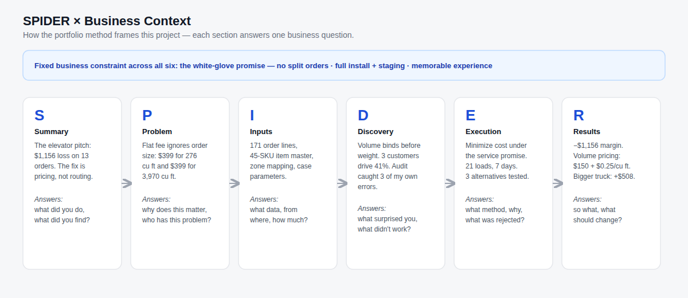
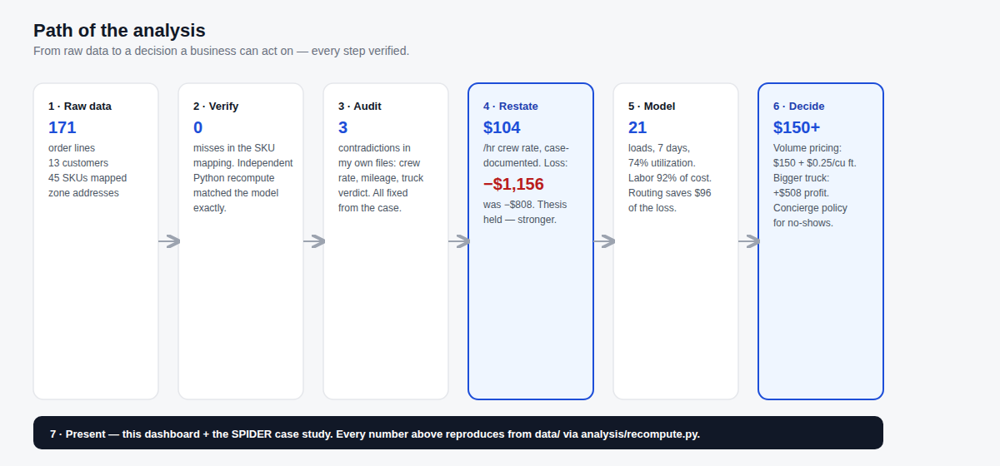
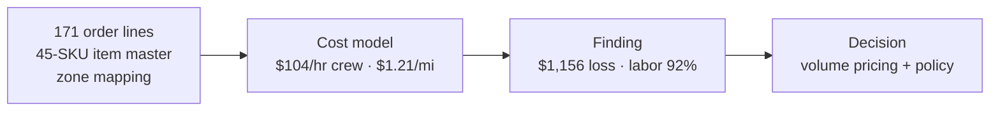
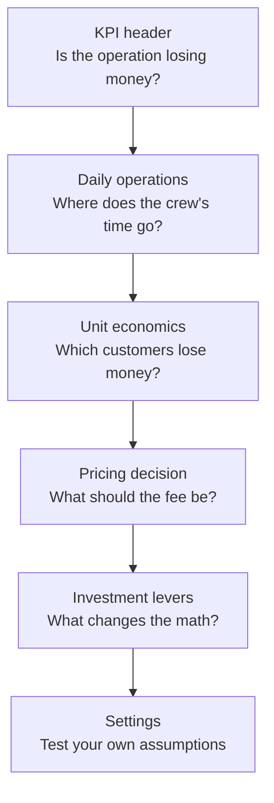

# Delivery Economics Dashboard

**A white-glove delivery operation losing $1,156 on 13 orders — and the fix isn't routing, it's pricing.**

A national luxury furniture retailer offered white-glove delivery at a flat rate per order. This repo is the full business case: the analysis, the rebuild, and the dashboard a manager would actually use. Labor is 92% of the cost, the service standard is fixed, and a 20% routing improvement saves $96 against a $1,156 loss. The only levers big enough are price and policy.

## The case, SPIDER-style

**S — Summary.** I was asked to optimize the operation: routes, truck loading, and the daily schedule for 13 Bay Area customers. I built the cost model from 171 raw order lines, optimized down to 7 days and 21 truckloads, and proved the loss is structural — then rebuilt the whole thing for publication with case-accurate numbers.

**P — Problem.** The flat-rate promise is a brand differentiator and a money loser: one customer pays $399 for 276 cubic feet, another pays $399 for 3,970. The white-glove standard is fixed — no split orders, no rushed crews, full install and staging — so cost-only optimization was never on the table. This is a workforce economics problem: a $104/hr three-person crew, 15-minute time rounding, 7 days of scheduled labor.

**I — Inputs.** Four sources, all in [`data/`](data/): 171 order lines, a 45-SKU item master (volume/weight per piece), customer addresses for zone mapping, and the case-documented operating parameters. [`analysis/recompute.py`](analysis/recompute.py) reproduces every number on this page from those files — run it.

**D — Discovery.** All 171 lines mapped with zero misses. Volume binds before weight. Three customers drive 41% of the volume. And the audit caught three contradictions in my own original files — a crew rate missing the driver premium, a mileage figure that didn't feed the fuel math, a scenario verdict contradicting its own numbers. All fixed from the primary sources; the loss moved from $808 to $1,156 and the thesis held.

**E — Execution.** Objective: minimize total operational cost subject to the service promise — not distance (it only touches 8% of cost), not utilization (100% would split customer orders across days). Sequence: geographic clustering, bin-pack to the 1,700 cu ft truck without splitting orders, assign to days inside the 540-minute window. Solver demoted to a ceiling test after it returned disconnected loops. Three alternatives tested: two trucks (+$1,092, rejected), luxury pace (+$3,040 — the price tag of the promise at its extreme), bigger truck (−$1,664, the only lever that wins).

**R — Results.** $6,043 cost vs $4,887 revenue: **−$1,156, −23.7% margin.** Eight of thirteen customers lose money; the five smallest subsidize the rest. Recommendations: volume-based pricing at $150 + $0.25/cu ft (or +$88.94 per delivery on flat fees), the concierge rescheduling policy for no-shows, and the bigger truck as the capital lever — it flips the loss into a $508 profit. Limitations: distances estimated at 25 mph, one truck modeled, rounding policy as stated not observed.

Full write-up: [CASE-STUDY.md](CASE-STUDY.md).

## What's in the repo

| Path | What it is |
|---|---|
| `index.html` | The dashboard — open in any browser, no build step |
| `CASE-STUDY.md` | Full SPIDER case study |
| `data/` | Raw inputs: order lines, item master, customer addresses |
| `analysis/recompute.py` | Reproduces every dashboard number from `data/` |
| `screenshots/` | Dashboard visuals |

## The dashboard flow

Each view answers one question, in order:

Six views: KPI header (with the service standard as a fixed constraint), daily operations (7-day schedule + rescheduling policy), unit economics (per-customer P&L), pricing decision (live volume-pricing calculator), investment levers (the three scenarios), and a settings drawer where every assumption is editable and every figure recomputes live.

Live demo: https://lorisca-analytics.github.io/delivery-economics-dashboard/
