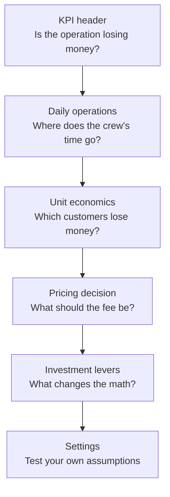
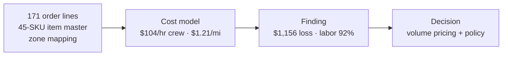

# Delivery Economics Dashboard

A business-facing dashboard for a national luxury furniture retailer's white-glove delivery operation. Companion to the case study [*Pricing, Not Routing*](../rh-delivery-economics-case-study.md).

**The one-line story:** the operation loses $1,156 on 13 deliveries, labor is 92% of the cost, and the white-glove service standard is fixed — so the fix is pricing and policy, not routing.

## Flow

How a reader moves through the dashboard — each view answers one question, in order:

The analytical flow underneath it:

Service standard is a fixed constraint throughout: no split orders, full install + staging + cleanup. Cost moves that degrade the experience were ruled out in the analysis and stay ruled out here.

## Views

1. **KPI header** — total cost, revenue, net, margin, cost per delivery, labor share.
2. **Daily operations** — the 7-day schedule (loads, travel/service minutes, miles) plus the concierge rescheduling policy.
3. **Unit economics** — labor/fuel split and a per-customer P&L table (cost allocated by volume at $0.2292/cu ft, stated in-app). Eight of thirteen customers lose money.
4. **Pricing decision** — interactive calculator: any order volume against the proposed $150 + $0.25/cu ft formula. Breakeven needs +$88.94 per delivery on the current book.
5. **Investment levers** — two trucks (+$1,092, rejected), luxury pace (+$3,040 — the price tag of the promise at its extreme), bigger truck (−$1,664, the only lever that reaches profitability: $508 profit).
6. **Settings** — editable crew rate, $/mile, fees, hours, miles. Every figure recomputes live.

## Run it

Open `index.html` in any browser — no build step, no server. Charts load from a CDN, so it needs internet on first load.

## Notes

- Crew rate is the case-documented $104/hr (driver premium + 30% benefits). The submitted coursework used $97.50 with the premium omitted; the restatement is documented in the case study.
- Distances estimated at 25 mph, no traffic modeling. Schedule minutes are as-planned; the P&L uses verified totals (53.5 hrs, 396 mi).
- Anonymized: no company, instructor, or customer names. Customer IDs are anonymous.
