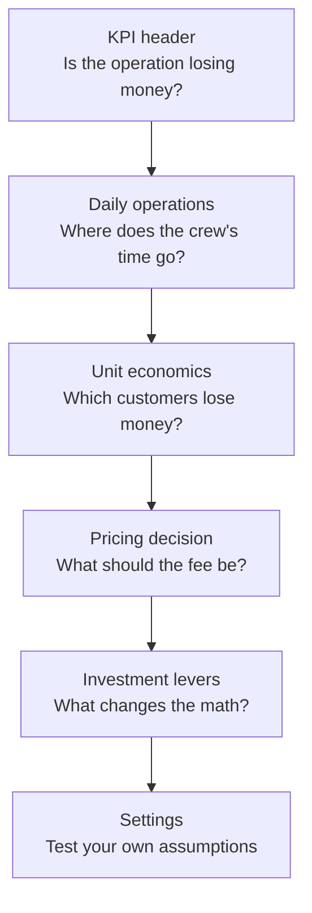
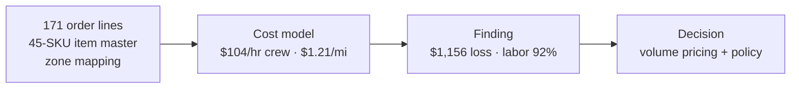

# Delivery Economics Dashboard

**A white-glove delivery operation losing $1,156 on 13 orders — and the fix isn't routing, it's pricing.**

A national luxury furniture retailer offered white-glove delivery at a flat rate per order. This dashboard is the business-facing view of the rebuild: the operation modeled end to end, the loss proven structural, and the decisions laid out. Labor is 92% of the cost, the service standard is fixed, and a 20% routing improvement saves $96 against a $1,156 loss. The only levers big enough are price and policy.

Companion case study: [*Pricing, Not Routing*](CASE-STUDY.md) — the full SPIDER write-up (Summary, Problem, Inputs, Discovery, Execution, Results), in this repo.

## What I did

This started as my MBA Global Operations final assignment (86/100, with the Excel model scoring 45/45). For the portfolio I rebuilt it properly:

1. **Started from the raw data.** 171 order lines, a 45-SKU item master, customer addresses. I recomputed every total independently in Python — all 171 lines mapped with zero misses, and the totals matched exactly.
2. **Audited the original.** The audit found three contradictions sitting in my own files: a crew rate that dropped the driver premium ($97.50 instead of the case-documented $104), a mileage figure that didn't feed the fuel calculation, and a scenario verdict that contradicted its own math. I fixed all three from the primary sources.
3. **Restated the economics.** At the correct $104/hr, the loss moved from $808 to $1,156 — and the thesis got stronger, not weaker.
4. **Reframed it for the business.** The original was built to defend in a viva. This version is built for an ops manager and a finance lead: the white-glove service standard shown as a fixed constraint, a per-customer P&L that names who the flat fee subsidizes, and every assumption editable live.

## Key decisions

- **Crew rate $104/hr, not $97.50.** The case states it explicitly (driver premium + 30% benefits). Documented as a found-and-fixed correction, not hidden.
- **Cost allocated by volume** ($0.2292/cu ft) for the per-customer P&L — the same logic as the pricing recommendation. Stated in the app, not buried.
- **The luxury promise is fixed.** No split orders, no rushed crews, full install + staging. That's why cost-only optimization was never the answer.
- **Bigger truck is the operational lever.** The original verdict said it "doesn't reach breakeven" — its own math showed a $508 profit. Corrected.

## Flow

Each view answers one question, in order:

The analytical flow underneath:

## Presented via SPIDER

The portfolio method structures the work; the repo presents each part where it belongs:

| SPIDER | Where it lives |
|---|---|
| **Summary** — the elevator pitch | Top of this README, and [CASE-STUDY.md](CASE-STUDY.md) §S |
| **Problem** — why it matters, who has it | [CASE-STUDY.md](CASE-STUDY.md) §P — the white-glove promise as a fixed constraint |
| **Inputs** — every data source | [CASE-STUDY.md](CASE-STUDY.md) §I |
| **Discovery** — what the data showed, dead ends | [CASE-STUDY.md](CASE-STUDY.md) §D — including the three contradictions the audit caught |
| **Execution** — methods, alternatives rejected | [CASE-STUDY.md](CASE-STUDY.md) §E + the dashboard's Investment levers |
| **Results** — quantified findings, recommendations, limitations | The dashboard itself + [CASE-STUDY.md](CASE-STUDY.md) §R |

## The views

1. **KPI header** — total cost $6,043, revenue $4,887, net −$1,156, margin −23.7%, $465 per delivery, 92% labor share.
2. **Daily operations** — the 7-day schedule (loads, travel/service minutes, miles) plus the concierge rescheduling policy: first reschedule free, $75 after — framed as service, priced to cover the wasted trip.
3. **Unit economics** — labor/fuel split and the per-customer P&L table. Eight of thirteen customers lose money; the five smallest orders subsidize the rest.
4. **Pricing decision** — interactive calculator: any order volume against the proposed $150 + $0.25/cu ft formula. Breakeven needs +$88.94 per delivery; the volume formula gets there without punishing small orders (276 cu ft → $219, 3,970 cu ft → $1,143).
5. **Investment levers** — two trucks (+$1,092, rejected), luxury pace (+$3,040 — the price tag of the brand promise at its extreme), bigger truck (−$1,664, the only lever that reaches profitability).
6. **Settings** — editable crew rate, $/mile, fees, hours, miles. Every figure on the page recomputes live, including the scenario cards.

## Run it

Open `index.html` in any browser — no build step, no server. Charts load from a CDN, so it needs internet on first load. If charts can't load, the KPIs and tables still render. Live demo: https://lorisca-analytics.github.io/delivery-economics-dashboard/

## Notes

- Distances estimated at 25 mph, no traffic modeling. Schedule minutes are as-planned; the P&L uses verified totals (53.5 hrs, 396 mi).
- Anonymized: no company, instructor, or customer names. Customer IDs are anonymous.
